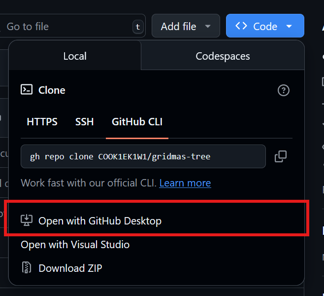

# Gridmas Tree - Web
This is a project based on Standup Maths' 500 LED christmas tree. [Watch his video here](https://www.youtube.com/watch?v=TvlpIojusBE)

# Docs
Documentation for the web edition can be found through the button labeled `Reference` on the homepage, and from the `/reference` section of the website.

# How To Setup
## Downloading
To download the Gridmas Tree web editor you can use any of the below tools:
- [GitHub desktop app](https://desktop.github.com/download/)
    
- [Git](https://git-scm.com/downloads)
    ```bash
    git clone https://github.com/COOK1EK1W1/gridmas-tree.git
    ```
- [GitHub CLI](https://cli.github.com/)
    ```bash
    gh repo clone COOK1EK1W1/gridmas-tree
    ```

## Setup
Now that you have the project downloaded, you a ready to install the project dependencies.
It is recommended to use the [NPM Bun](https://www.npmjs.com/package/bun) package for running the project. 

To install the dependencies:
```bash
bun i
```
Now wait for the dependencies to be installed.

## Run
To run the project, run the below command:
```bash
bun run dev
```

This will start a local web server which you can access. There will be an IP address echo'd in your terminal, _copy/paste_ it into your browser of choice to see the web view

# How to run docs locally
The documentaion for GRIDmas Tree is generated automatically with MKDocs. This is done through MKDocStrings.
To run the docs on a local webserver, you must do the following:
1. Install dependencies through `pip install -r "requirements.txt"`
2. Run `mkdocs serve`
The MKDocs site will now build locally. Please note that if you have never done this before on your machine, it could take anywhere from 1 second to 5 minutes to build the docs. There are a lot of files it needs to parse. After you have done it once, the docs will take less time on each subsequent build.

Once you have the local server running, you can make changes to the documentation MD files, and the changes will take effect instantly, no need to stop and start the server.
If you make changes to any of the docstrings in the code, you will need to restart the MKDocs server, as it is only checking for changes to the markdown files.
